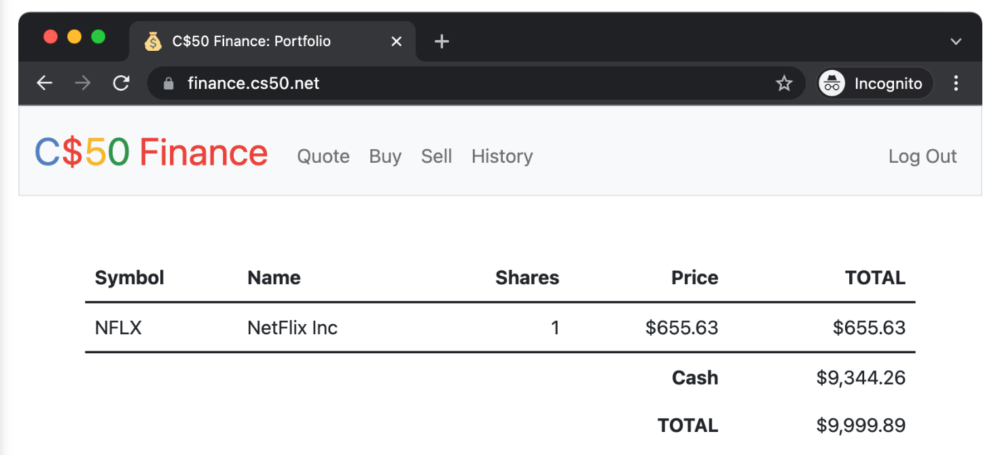

# Finance

Finance is a website built with Flask via which users can “buy” and “sell” stocks, a la the below.

On sign up, the user will have $10,0000. Not only will this tool allow you to check real stocks’ actual prices and portfolios’ values, it will also let you buy (okay, “buy”) and sell (okay, “sell”) stocks by querying IEX for stocks’ prices.

Indeed, IEX lets you download stock quotes via their API (application programming interface) using URLs like https://cloud-sse.iexapis.com/stable/stock/nflx/quote?token=API_KEY. Notice how Netflix’s symbol (NFLX) is embedded in this URL; that’s how IEX knows whose data to return. That link won’t actually return any data because IEX requires you to use an API key (more about that in a bit), but if it did, you’d see a response in JSON (JavaScript Object Notation).

## How to run this web app
1. this is a flask app so, flask should be installed in your system via `pip install flask`
2. Install cs50 library for python via [this link](https://cs50.readthedocs.io/libraries/cs50/python/)
3. ### Configuring
  Before getting started, we’ll need to register for an API key in order to be able to query IEX’s data. To do so, follow these steps:

-Visit [iexcloud.io](iexcloud.io/cloud-login#/register/).

-Select the “Individual” account type, then enter your name, email address, and a password, and click “Create account”.

-Once registered, scroll down to “Get started for free” and click “Select Start plan” to choose the free plan.

-Once you’ve confirmed your account via a confirmation email, [visit](https://iexcloud.io/console/tokens).

-Copy the key that appears under the Token column (it should begin with pk_).

-In your terminal window, execute:

- `$ export API_KEY=value`
where value is that (pasted) value, without any space immediately before or after the =. You also may wish to paste that value in a text document somewhere, in case you need it again later.

4. ### Running
Start Flask’s built-in web server (within finance/):

`$ flask run`
